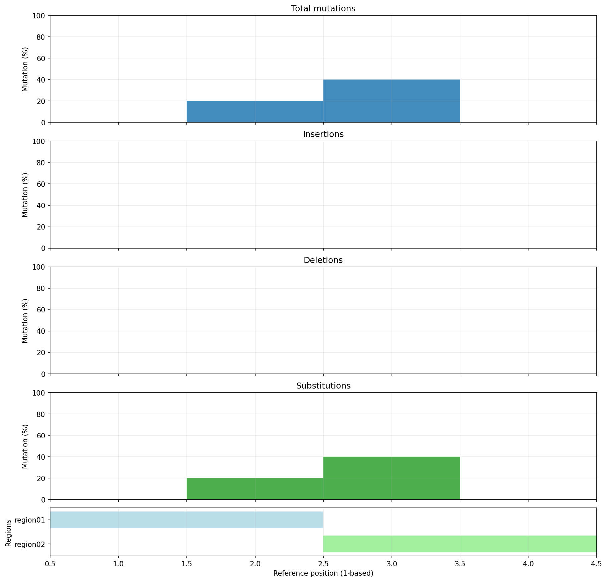

[](https://choosealicense.com/licenses/mit/)
[](https://github.com/akikuno/cstag/actions)
[](https://pypi.org/project/cstag/)
[](https://pypi.org/project/cstag/)
[](https://anaconda.org/bioconda/cstag)
[](https://doi.org/10.21105/joss.06066)
[](https://zenodo.org/badge/latestdoi/468937655)

 

`cstag` is a Python library tailored for manipulating and visualizing [minimap2's cs tags](https://github.com/lh3/minimap2#cs).

>[!NOTE]
> To add cs tags to SAM/BAM files, check out [`cstag-cli`](https://github.com/akikuno/cstag-cli).  

## 🌟 Features

- `cstag.call()`: Generate a cs tag
- `cstag.shorten()`: Convert a cs tag from its long to short format
- `cstag.lengthen()`: Convert a cs tag from its short to long format
- `cstag.consensus()`: Create a consensus cs tag from multiple cs tags
- `cstag.mask()`: Mask low-quality bases within a cs tag
- `cstag.split()`: Break down a cs tag into its constituent parts
- `cstag.revcomp()`: Convert a cs tag to its reverse complement
- `cstag.to_sequence()`: Reconstruct a reference subsequence from the alignment
- `cstag.to_vcf()`: Generate a VCF representation
- `cstag.to_html()`: Generate an HTML representation
- `cstag.to_mutation_percentages()`: Report and plot per-position mutation percentages

For comprehensive documentation, please visit [our docs](https://akikuno.github.io/cstag/).


## 🛠 Installation

`cstag` requires Python 3.11 or later.

Using [PyPI](https://pypi.org/project/cstag/):

```bash
pip install cstag
```

Using [Bioconda](https://anaconda.org/bioconda/cstag):

```bash
conda install -c bioconda cstag
```

### Development

Install the package and its development dependency group, then run the local
quality checks:

```bash
python -m pip install -e . --group dev --group docs
ruff format --check .
ruff check .
mypy
python -m pytest tests -W error
python -m pytest --doctest-modules --doctest-glob=README.md README.md src/cstag -W error
python -m build
```

## 💡 Usage

### Generating cs tags

```python
import cstag

cigar = "8M2D4M2I3N1M"
md = "2A5^AG7"
seq = "ACGTACGTACGTACG"

print(cstag.call(cigar, md, seq))
# :2*ag:5-ag:4+ac~nn3nn:1

print(cstag.call(cigar, md, seq, long=True))
# =AC*ag=TACGT-ag=ACGT+ac~nn3nn=G
```

### Shortening or Lengthening cs tags

```python
import cstag

# Convert a cs tag from long to short
cs_tag = "=ACGT*ag=CGT"

print(cstag.shorten(cs_tag))
# :4*ag:3


# Convert a cs tag from short to long
cs_tag = ":4*ag:3"
cigar = "8M"
seq = "ACGTACGT"

print(cstag.lengthen(cs_tag, cigar, seq))
# =ACGT*ag=CGT
```

### Creating a Consensus

```python
import cstag

cs_tags = ["=ACGT", "=AC*gt=T", "=C*gt=T", "=C*gt=T", "=ACT+ccc=T"]
positions = [1, 1, 2, 2, 1]

print(cstag.consensus(cs_tags, positions))
# =AC*gt=T
```

To require a minimum level of agreement and report consensus quality, set
`min_agreement` to a value between 0 and 1. The returned dictionary retains the
candidate consensus even when it does not pass the requirement.

```python
import cstag

cs_tags = ["=ACGT", "=ACGT", "=ACGT", "=AC*gt=T"]
positions = [1, 1, 1, 1]

print(cstag.consensus(cs_tags, positions, min_agreement=0.75))
# {
#     'consensus': '=ACGT',
#     'passed': True,
#     'agreement': 0.75,
#     'max_edit_distance': 1,
# }
```

`agreement` is the lowest modal-token fraction over all covered reference
positions. `max_edit_distance` is the largest, among all reads, of the
Levenshtein distance to its nearest overlapping read. Use `return_result=True`
to obtain the same report without applying an agreement threshold. Calls that
set neither option continue to return only the consensus string.

### Masking Low-Quality Bases

```python
import cstag

cs_tag = "=ACGT*ac+gg-cc=T"
cigar = "5M2I2D1M"
qual = "AA!!!!AA"
phred_threshold = 10
print(cstag.mask(cs_tag, cigar, qual, phred_threshold))
# =ACNN*an+ng-cc=T
```

### Splitting a cs tag

```python
import cstag

cs_tag = "=ACGT*ac+gg-cc=T"
print(cstag.split(cs_tag))
# ['=ACGT', '*ac', '+gg', '-cc', '=T']
```

### Reverse Complement of a cs tag

```python
import cstag

cs_tag = "=ACGT*ac+gg-cc=T"
print(cstag.revcomp(cs_tag))
# =A-gg+cc*tg=ACGT
```

### Reconstructing the Reference Subsequence

```python
import cstag

cs_tag = "=AC*gt=T-gg=C+tt=A"
print(cstag.to_sequence(cs_tag))
# ACTTCTTA
```

### Generating a VCF Report

```python
import cstag

cs_tag = "=AC*gt=T-gg=C+tt=A"
chrom = "chr1"
pos = 1
print(cstag.to_vcf(cs_tag, chrom, pos))
"""
##fileformat=VCFv4.2
#CHROM	POS	ID	REF	ALT	QUAL	FILTER	INFO
chr1	3	.	G	T	.	.	.
chr1	4	.	TGG	T	.	.	.
chr1	5	.	C	CTT	.	.	.
"""
```

The multiple cs tags enable reporting of the variant allele frequency (VAF).

```python
import cstag

cs_tags = ["=ACGT", "=AC*gt=T", "=C*gt=T", "=ACGT", "=AC*gt=T"]
chroms = ["chr1", "chr1", "chr1", "chr2", "chr2"]
positions = [2, 2, 3, 10, 100]
print(cstag.to_vcf(cs_tags, chroms, positions))
"""
##fileformat=VCFv4.2
##INFO=<ID=DP,Number=1,Type=Integer,Description="Total Depth">
##INFO=<ID=RD,Number=1,Type=Integer,Description="Depth of Ref allele">
##INFO=<ID=AD,Number=1,Type=Integer,Description="Depth of Alt allele">
##INFO=<ID=VAF,Number=1,Type=Float,Description="Variant allele frequency (AD/DP)">
#CHROM	POS	ID	REF	ALT	QUAL	FILTER	INFO
chr1	4	.	G	T	.	.	DP=3;RD=1;AD=2;VAF=0.667
chr2	102	.	G	T	.	.	DP=1;RD=0;AD=1;VAF=1.0
"""
```

### Generating an HTML Report

```python
import cstag
from pathlib import Path

cs_tag = "=AC+ggg=T-acgt*at~gt10ag=GNNN"
description = "Example"

cs_tag_html = cstag.to_html(cs_tag, description)
Path("report.html").write_text(cs_tag_html)
# Output "report.html"
```

You can visualize mutations indicated by the cs tag using the generated `report.html` file as shown below:


### Plotting Mutation Percentages

```python
from pathlib import Path

import cstag

cs_tags = ["=ACGT", "=AC*gt=T", "=C*gt=T", "=ACGT", "=AC*gt=T"]
regions = [
    {"name": "region01", "start": 1, "end": 2, "color": "lightblue"},
    {"name": "region02", "start": 3, "end": 4, "color": "lightgreen"},
]

report = cstag.to_mutation_percentages(
    cs_tags,
    Path("mutation_percentages.pdf"),
    regions=regions,
)
print(report)
"""
[{'coverage': 5,
  'deletion_pct': 0.0,
  'insertion_pct': 0.0,
  'position': 1,
  'substitution_pct': 0.0,
  'total_pct': 0.0},
 {'coverage': 5,
  'deletion_pct': 0.0,
  'insertion_pct': 0.0,
  'position': 2,
  'substitution_pct': 20.0,
  'total_pct': 20.0},
 {'coverage': 5,
  'deletion_pct': 0.0,
  'insertion_pct': 0.0,
  'position': 3,
  'substitution_pct': 40.0,
  'total_pct': 40.0},
 {'coverage': 4,
  'deletion_pct': 0.0,
  'insertion_pct': 0.0,
  'position': 4,
  'substitution_pct': 0.0,
  'total_pct': 0.0}]
"""
```



The function accepts short- or long-form cs tags and returns one dictionary per
1-based relative reference position. Percentages are reported for all mutations,
insertions, deletions, and substitutions. A PDF is saved as editable vector
graphics; use a `.png` output path for a raster image.


## 📣 Feedback and Support

For questions, bug reports, or other forms of feedback, we'd love to hear from you!  
Please use [GitHub Issues](https://github.com/akikuno/cstag/issues) for all reporting purposes.  

Please refer to [CONTRIBUTING](https://github.com/akikuno/cstag/blob/main/CONTRIBUTING.md) for how to contribute and how to verify your contributions.  


## 🤝 Code of Conduct

Please note that this project is released with a [Contributor Code of Conduct](https://github.com/akikuno/cstag/blob/main/CODE_OF_CONDUCT.md).  
By participating in this project you agree to abide by its terms.  

## 📄 Citation

- Kuno, A., (2024). cstag and cstag-cli: tools for manipulating and visualizing cs tags. *Journal of Open Source Software*, 9(93), 6066, https://doi.org/10.21105/joss.06066
